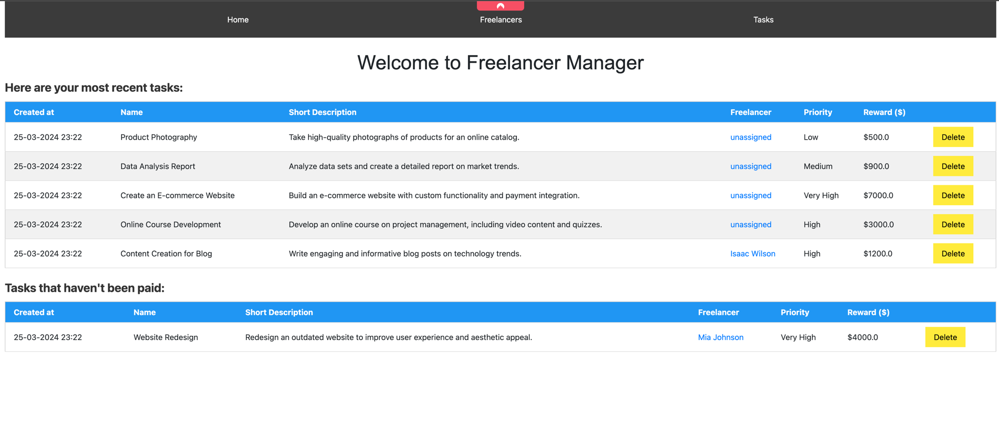
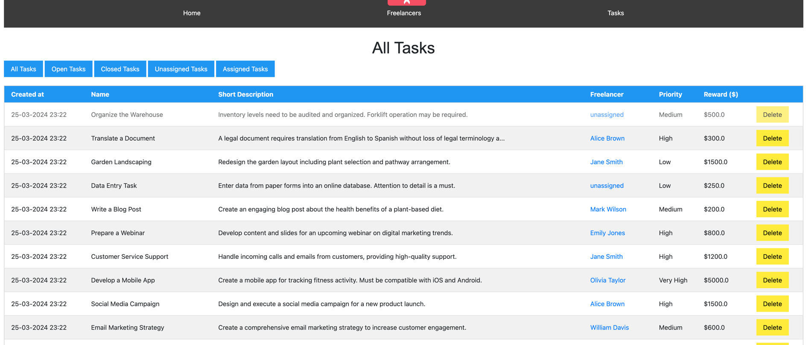

# freelancers manager

## Introduction

This is a freelancer manager Java application. It uses Spring Boot with Thymeleaf for frontend and APIs, and mySQL database deployed with docker for the data storage.

The app is used to manage freelancers of a company, to assign them tasks.

## Description

This app stores freelancers, and their personal information, with tasks they should do.

### Tasks
You can view an overview of tasks in the "Tasks" section. You can view open / closed tasks, assigned / unassigned.

#### View a task
You can view a task by clicking on it. It'll show task details and more info. You can also assign it to a freelancer by clicking on the "Assigned Freelancer" field.

#### Modify Task
You can also modify this task by clicking the modify button.

#### Add Task
You can add a task by clicking on the "Add Task" at the bottom of the tasks page

### Freelancers
You can view an overview of freelancers in the "Freelancers" section.

#### View a freelancer
You can view information about the freelancer by clicking on it. This also allows you to create a new task that will be assigned to a freelancer
right away.

## How to start the application
* You need to have a Docker running, and compose the docker by running `docker compose up`, this will start the mySQL database
* Start the app as a spring boot application `mvn spring-boot:run`
* Go to `http://localhost:8080/`, and your app will be running and working
* You can run the `freelancerManagerClients - populate_databases.py` to populate the freelancers and tasks by dummy data